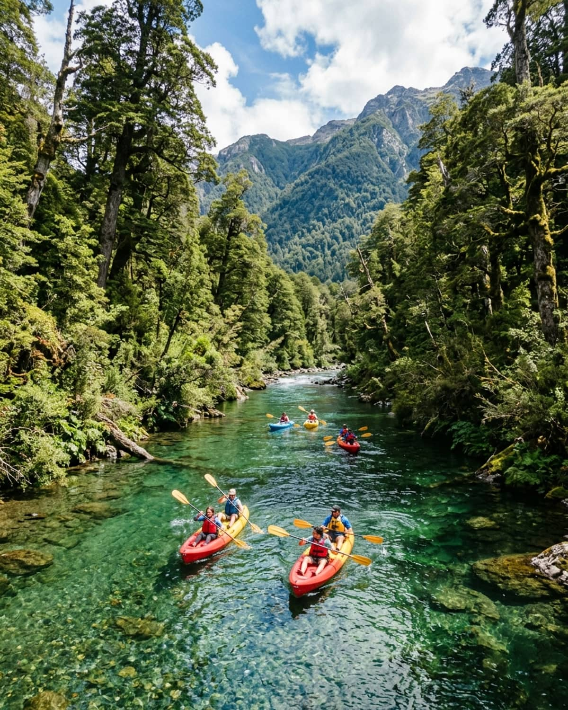

# 🚣‍♂️ Travesía y Bajada de Kayak en Parque Nacional Los Alerces
### Facultad de Ciencias Económicas — Universidad Nacional de la Patagonia San Juan Bosco (UNPSJB) Sede Esquel



Portal web oficial y galería multimedia interactiva para la **Travesía y Bajada de Kayak en el Parque Nacional Los Alerces**, un evento histórico reactivado en **abril de 2026** tras permanecer pausado desde 1997.

---

## 🌟 Características Principales del Sitio Web

1. **Hero con Parallax & Video Integrado:**
   - Reproducción en bucle del video oficial directamente desde YouTube (`https://youtube.com/shorts/t5qNJe3UqBc`).
   - Escudo oficial transparente de la **Facultad de Ciencias Económicas (FCE UNPSJB)** sensible al movimiento Parallax y scroll.
   - Anuncio destacado de la **Próxima Edición: 12 y 13 de Diciembre de 2026**.

2. **Historia & Artículos Periodísticos:**
   - Reseña completa del trayecto de 20 km (Lago Verde ➔ Río Arrayanes ➔ Bahía Rosales).
   - Testimonios y cobertura mediática del evento recuperado en 2026 con más de 42 remeros universitarios y vecinos de la Comarca del Ande.

3. **Galería Fotográfica Multivista:**
   - Selección de fotos de alta resolución del Parque Nacional Los Alerces.
   - Alternador de vistas: **Grilla Mosaico (Masonry)** y **Modo Carrusel** deslizante con autodepliegue.
   - Visor **Lightbox** a pantalla completa y enlace directo a la [Carpeta Oficial de Fotos en Google Drive](https://drive.google.com/drive/folders/1t2gUt2ecHjFj2KRR2Z2_L6Mwt_5ZMMUS).

4. **Organizadores:**
   - Tarjeta biográfica y reseña de **Cr. / Lic. Adrián Cardacci** (Delegado Académico de la FCE UNPSJB Sede Esquel), impulsor clave de la reactivación institucional.
   - Información sobre comisiones de deportes, seguridad náutica e intendencia del Parque Nacional Los Alerces.

5. **Auspiciantes & Reseñas:**
   - Franja organizada de logos de instituciones auspiciantes (Chubut Deportes, Parques Nacionales, Municipalidad de Esquel, Prefectura Naval Argentina, Ejército Argentino) ubicada sobre el footer.
   - Ventana modal dedicada con reseñas detalladas y enlace directo al [Documento Oficial de Reseñas en Google Docs](https://docs.google.com/document/d/19LmdzNiZezFDLwy8k-WqJpZpF3EknkVx/edit).

---

## 🚀 Despliegue en VPS (Puerto Aleatorio)

Este proyecto es una aplicación web estática autónoma (HTML5 / CSS3 / Vanilla JS).

### Opción A: Despliegue con Docker (Recomendado)
```bash
# Construir la imagen
docker build -t travesia-kayak .

# Ejecutar en un puerto aleatorio del VPS (ejemplo puerto 8085 o $PORT)
PORT=${PORT:-$(shuf -i 8000-9000 -n 1)}
docker run -d -p $PORT:80 --name travesia-kayak-app travesia-kayak

echo "Aplicación ejecutándose en: http://tu-vps-ip:$PORT"
```

### Opción B: Despliegue con Nginx o Caddy
```bash
# Copiar archivos al directorio público
git clone https://github.com/leanchoi/travesia-kayak-los-alerces.git /var/www/travesia-kayak
```

### Opción C: Despliegue rápido con Node.js / Serve
```bash
npx serve . -p 8085
```

---

## 💻 Desarrollo Local

```bash
git clone https://github.com/leanchoi/travesia-kayak-los-alerces.git
cd travesia-kayak-los-alerces
# Abrir index.html en cualquier navegador o ejecutar un servidor estático
```

---
*Facultad de Ciencias Económicas — UNPSJB Sede Esquel*